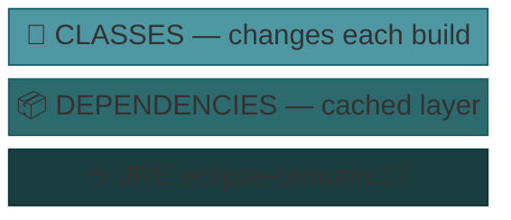
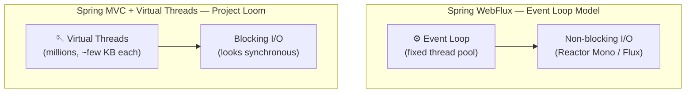
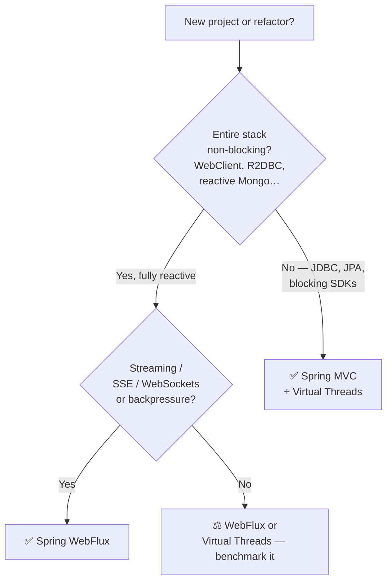

# Reactive RESTful API — Spring WebFlux

> **Archived project** — built a few years ago as a learning exercise and left untouched since.
> It was **not** migrated to Spring Boot 3 or 4. Instead, the codebase was refreshed just enough
> to compile and run on its original **Spring Boot 2.4.4 / Java 17** baseline
> (compatibility fixes: [pom.xml overhaul](https://github.com/mrzodeczko-dev/Archived-Reactive-RESTful-API-with-Spring-Webflux/commit/0bac2c97082c9db635f06e1275dacf682869012a)).
>
> ⚠️ **Migration note:** The Spring ecosystem changed significantly between Spring Boot 2.x and
> Spring Boot 3.x / 4.x. A real migration would require:
> - Full `javax.*` → `jakarta.*` package rename (breaking change in every file)
> - Spring Security 6 rewrite — `WebSecurityConfigurerAdapter` removed, replaced with `SecurityFilterChain` beans
> - Mongock API changes (4.x → 5.x driver model)
> - Spring Data MongoDB reactive API updates
> - Minimum Java version bumped to 17 (Boot 3) / 21 (Boot 4)
>
> The project is kept as-is for reference and portfolio purposes.

A reactive REST API built with **Domain-Driven Design (DDD)** on top of Spring WebFlux and Netty. The full I/O pipeline is non-blocking: WebFlux router + reactive MongoDB driver + replica set transactions — no blocking thread is ever held during a request.

---

## Table of Contents

- [Tech Stack](#tech-stack)
- [Prerequisites](#prerequisites)
- [Quick Start](#quick-start)
- [Architecture](#architecture)
- [MongoDB Replica Set](#mongodb-replica-set)
- [Docker Commands](#docker-commands)
- [OpenAPI / Swagger UI](#openapi--swagger-ui)
- [Why Reactive?](#why-reactive)

---

## Tech Stack

### Core

| Layer | Technology | Version |
|---|---|---|
| Framework | Spring Boot | 2.4.4 |
| Reactive web | Spring WebFlux + Netty | via Boot |
| Reactive runtime | Project Reactor | via Boot |
| Java | Eclipse Temurin | 17 |

### Persistence

| Layer | Technology | Version |
|---|---|---|
| Database | MongoDB | 4.4.4 |
| Reactive driver | spring-boot-starter-data-mongodb-reactive | via Boot |
| Sync driver | mongodb-driver-sync | via Boot |
| DB migrations | Mongock | 4.2.8.BETA |

### Security & Auth

| Layer | Technology | Version |
|---|---|---|
| Security | Spring Security (WebFlux) | via Boot |
| JWT | JJWT (api / impl / jackson) | 0.11.2 |

### Observability & Tooling

| Layer | Technology | Version |
|---|---|---|
| Logging | Log4j2 (spring-boot-starter-log4j2) | via Boot |
| API docs | springdoc-openapi WebFlux UI | 1.5.2 |
| Blocking detector | BlockHound | 1.0.6.RELEASE |
| Code generation | Lombok | 1.18.34 |

### Utilities

| Library | Purpose | Version |
|---|---|---|
| opencsv | CSV parsing | 5.0 |
| commons-validator | Input validation | 1.7 |
| joda-time | Date/time handling | 2.10.8 |
| jackson-databind | JSON serialisation | via Boot |
| jackson-dataformat-yaml | YAML config support | via Boot |
| spring-aspects | AOP / AspectJ | 5.3.1 |

### Infrastructure

| Layer | Technology |
|---|---|
| Containerization | Docker |
| Local orchestration | Docker Compose |
| Production orchestration | Docker Swarm |
| Build tool | Maven 3.8+ |

---

## Prerequisites

- **Docker** and **Docker Compose** (Docker Swarm mode enabled for swarm deployment)
- **Java 17** + **Maven 3.8+** (for local build)

---

## Quick Start

```bash
# 1. Build the application (skip tests for speed)
mvn clean package -DskipTests

# 2. Start all containers (app + MongoDB replica set)
docker-compose up -d --build
```

Swagger UI available at: [http://localhost:8080/docs](http://localhost:8080/docs)

---

## Architecture

The entire application is containerised. The layered Docker image build uses `maven-dependency-plugin` to split the fat JAR into **dependencies** and **classes** — dependencies are cached between builds, only changed classes are re-copied:



Two Docker Compose files are provided:

| File | Purpose |
|---|---|
| `docker-compose.yml` | Local development — builds image from source |
| `docker-swarm.yml` | Production — deploys a stack to Docker Swarm |

---

## MongoDB Replica Set

The app uses **MongoDB distributed transactions**, which require a replica set. Three nodes are configured:


All replica nodes are containerised with persistent Docker volumes.

---

## Docker Commands

### Docker Compose (development)

```bash
# Start all containers in the background
docker-compose up -d --build

# Follow logs
docker-compose logs -f

# Stop and remove containers, networks, volumes
docker-compose down
```

### Docker Swarm (production)

```bash
# Deploy stack
docker stack deploy -c docker-swarm.yml <appName>

# List stack tasks
docker stack ps <appName>

# Remove stack
docker stack rm <appName>
```

---

## OpenAPI / Swagger UI

Interactive API documentation is available at:

```
http://localhost:8080/docs
```

---

## Why Reactive?

### WebFlux vs Project Loom — Virtual Threads

Java 21 (released September 2023) introduced **Virtual Threads** (Project Loom, JEP 444) as a production-ready feature. This changed the calculus around reactive programming significantly — it is worth understanding where WebFlux still makes sense and where Virtual Threads are the better fit.

#### How they work



- **WebFlux** uses a small, fixed event-loop thread pool (usually `2 × CPU cores`). All I/O must be non-blocking — a single blocking call stalls the entire loop.
- **Virtual Threads** are lightweight threads managed by the JVM, not the OS. Each request gets its own thread. When it blocks on I/O, the JVM parks the virtual thread and reuses the carrier (OS) thread for other work — making blocking cheap.

#### Performance benchmarks

| Scenario | WebFlux (Netty) | Virtual Threads (Netty) | Winner |
|---|---|---|---|
| REST API, 100 ms DB latency | ~48 000 req/s | ~51 000 req/s | Virtual Threads |
| High concurrency (10 000+ users) | ~48 000 req/s | ~51 000 req/s | Virtual Threads |
| Memory (10 000 idle connections) | ~200 MB | ~250 MB | WebFlux |
| JWT verify + MySQL query | faster | 57% slower | WebFlux |
| DB-heavy microservice (Red Hat) | baseline | +40% throughput | Virtual Threads |

> Benchmarks: Spring Boot 3.2–3.4, 4–16 core machines. Results vary by workload — always measure your own case.

In independent benchmarks comparing Virtual Threads on Netty vs WebFlux on Netty, Virtual Threads won ~45% of scenarios vs ~30% for WebFlux, with no clear winner in the remaining cases.

#### Decision guide



| Use WebFlux when… | Use Virtual Threads (Spring MVC) when… |
|---|---|
| Full reactive stack: WebClient, R2DBC, reactive MongoDB | Stack uses JDBC / JPA / Hibernate / any blocking driver |
| Real-time streaming: SSE, WebSockets, Kafka consumer | Classic REST microservice |
| Backpressure control is required | Team prefers readable, debuggable synchronous code |
| API gateway / BFF / fan-out edge service | Using blocking third-party SDKs |
| Team is experienced with `Mono`/`Flux` | New project on Java 21+ |

> **Bottom line (2025–2026):** For most CRUD microservices touching a relational database, **Spring MVC + Virtual Threads** is now the pragmatic default — simpler to write, test, and debug with comparable or better throughput. WebFlux remains the right choice for streaming workloads and fully non-blocking stacks.

### Raw throughput: WebFlux vs blocking Servlet

According to [Spring MVC vs WebFlux benchmarks](https://filia-aleks.medium.com/microservice-performance-battle-spring-mvc-vs-webflux-80d39fd81bf0):

> Spring WebFlux with WebClient wins in all cases over *classic* blocking Servlet. The most significant difference (4× faster) appears when the underlying service is slow (500 ms). It uses far fewer threads (20 vs 220).

This advantage largely disappears when comparing WebFlux against Spring MVC + Virtual Threads, which is why the choice in 2025 is less clear-cut than it was when this project was built.

### Summary

- ✅ This project uses WebFlux **correctly** — the full stack is non-blocking (reactive MongoDB driver, no JDBC)
- ✅ Reactive Mongo with replica set transactions is a legitimate use case for WebFlux
- ⚠️ If this project were greenfield today and used a relational DB, **Spring MVC + Virtual Threads** would likely be the better choice
