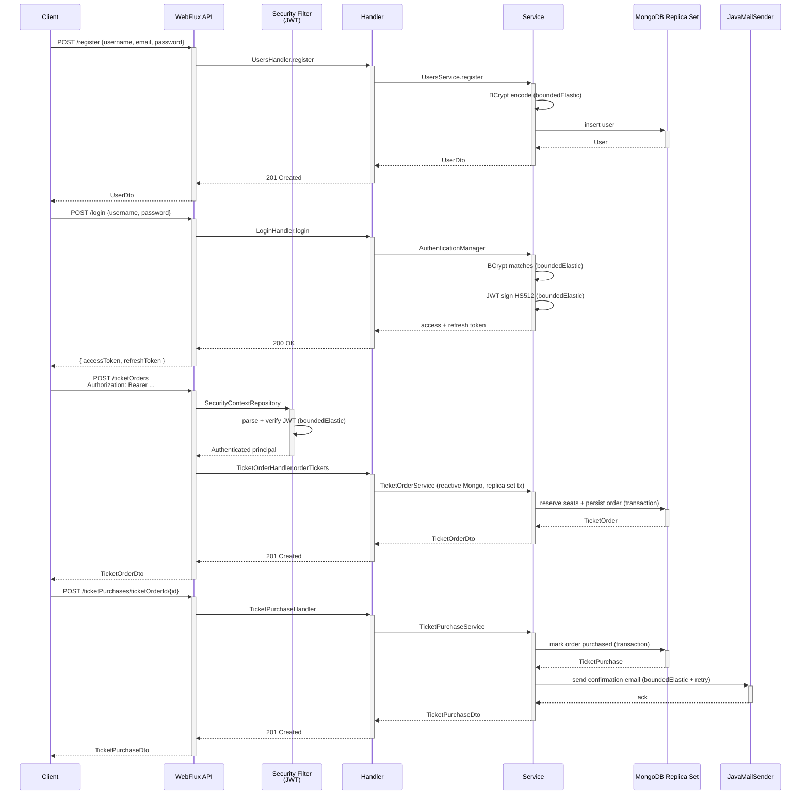
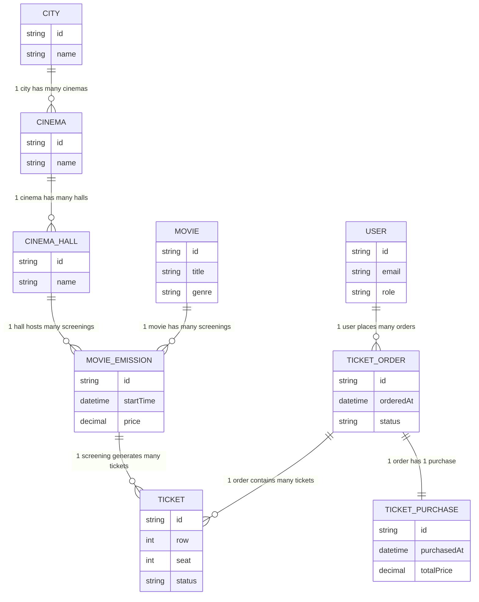
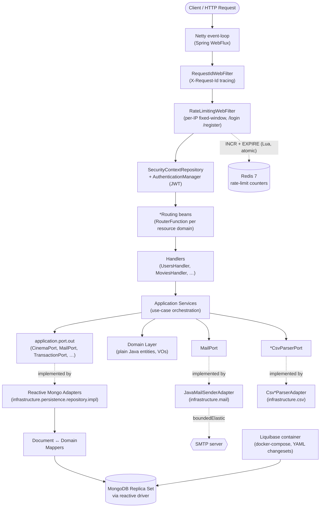
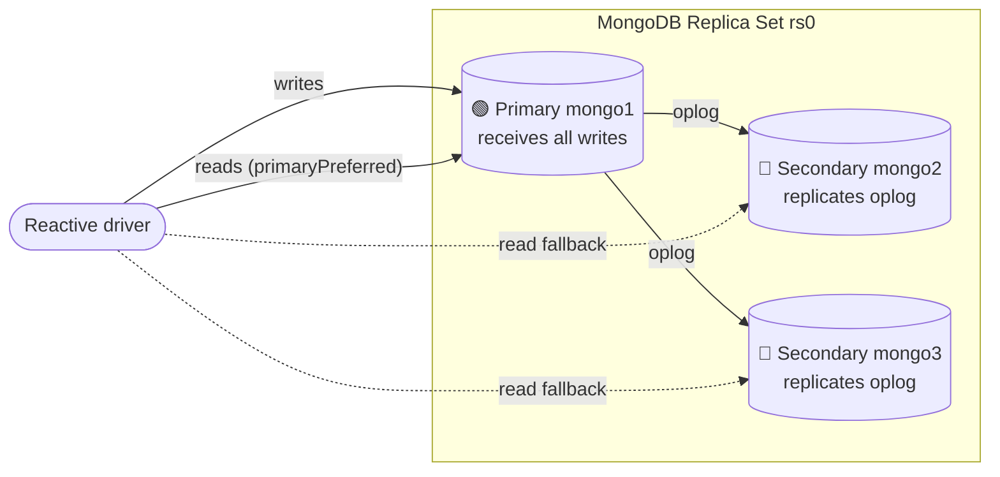
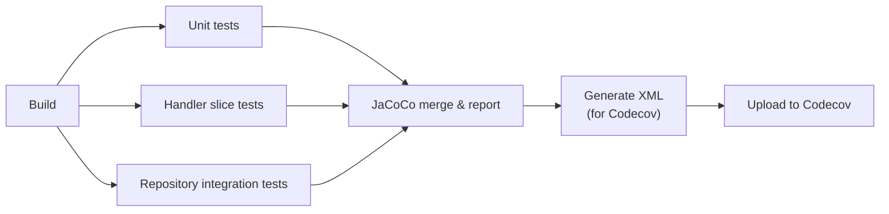

# Reactive RESTful API – Cinema Ticketing Platform (Spring WebFlux)

[](https://spring.io/projects/spring-boot)
[](https://openjdk.org/)
[](https://docs.spring.io/spring-framework/reference/web/webflux.html)
[](https://www.mongodb.com/)
[](https://www.docker.com/)
[](https://github.com/mrzodeczko-dev/Archived-Reactive-RESTful-API-with-Spring-Webflux/actions/workflows/ci.yml)
[](https://codecov.io/github/mrzodeczko-dev/Reactive-RESTful-API-Cinema-Ticketing-Platform-Spring-WebFlux-)
[](https://opensource.org/licenses/MIT)

>  Originally built as a learning exercise on Spring Boot 2.4.4 / Java 17, then iteratively migrated to **Spring Boot 4.0.6 / Java 25** and refactored into a hexagonal / DDD-inspired layout. Kept for reference and portfolio purposes.

<a id="toc"></a>
## Table of Contents

- [Overview](#overview)
- [How It Works](#how-it-works)
- [Business Domain](#business-domain)
- [Role-Based Access Control](#role-based-access-control)
- [API Endpoints](#api-endpoints)
- [Getting Started](#getting-started)
- [Environment Variables](#environment-variables)
- [Architecture](#architecture)
- [MongoDB Replica Set](#mongodb-replica-set)
- [Non-Blocking Integrations](#non-blocking-integrations)
- [Technical Highlights](#technical-highlights)
- [Tech Stack](#tech-stack)
- [Testing](#testing)
- [CI Pipeline](#ci-pipeline)
- [Observability](#observability)
- [Repository Structure](#repository-structure)
- [Why Reactive?](#why-reactive)
- [Contact](#contact)

---

<a id="overview"></a>
## Overview

[↑ Back to top](#toc)

A reactive REST API for a **cinema ticketing system** — manages a network of cinemas and the full ticket purchasing flow (browse cities → cinemas → screenings → seats → order → purchase). The full I/O pipeline is non-blocking: **Spring WebFlux** on Netty, **reactive MongoDB driver** with a 3-node replica set for distributed transactions, and JWT-based authentication. Every CPU-bound or blocking call (BCrypt, JWT signing, CSV parsing, SMTP) is explicitly offloaded to `Schedulers.boundedElastic()`.

The codebase follows a **hexagonal / DDD-inspired** layering: a `domain` layer with plain Java entities free of Spring/Mongo/Lombok annotations; an `application` layer that orchestrates use cases against `port/out` interfaces; and an `infrastructure` layer with reactive Mongo adapters, security, AOP, and migrations. HTTP routing lives in a `presentation` layer using functional `RouterFunction` + handler beans.

> **DDD status:** the domain package is genuinely free of Spring imports, Mongo annotations, and Lombok; persistence concerns are isolated in `infrastructure/persistence` (separate `*Document` classes + mappers + repository adapters). Application services operate on Reactor `Mono`/`Flux` directly — this is by design rather than a limitation, since `Mono`/`Flux` signatures are necessary to compose a fully non-blocking pipeline end-to-end. This is best described as **DDD-inspired hexagonal layering with Reactor**, rather than a textbook framework-agnostic clean architecture.

---

<a id="how-it-works"></a>
## How It Works

[↑ Back to top](#toc)

The system has two distinct actor flows: a **regular user** browsing and buying tickets, and an **admin** building and maintaining the catalog.

### User flow — browsing and purchasing a ticket



1. **Registration** — public endpoint; BCrypt hashing runs on `boundedElastic`.
2. **Login** — issues JWT access token (HS512, 5 min) + refresh token (8 h); signing runs on `boundedElastic`.
3. **Token refresh** — `POST /refresh` accepts the refresh JWT in the request body, validates its signature and expiry, verifies it is not an access token (via the `AccessTokenKey` claim), then issues a new access + refresh token pair (token rotation). Runs on `boundedElastic`.
4. **Authenticated requests** — `SecurityContextRepository` + `AuthenticationManager` parse the bearer token and populate the reactive security context.
5. **Ticket ordering** — reserves seats atomically inside a **MongoDB distributed transaction**.
6. **Ticket purchase** — finalises an order in a transaction, then sends a confirmation email via SMTP (offloaded to `boundedElastic` with retries).

### Admin flow — building and maintaining the catalog

1. **Catalog bootstrapping** — admin uploads CSV files in order: cities → cinemas → cinema halls → movies → movie emissions. Each import is **atomic**: if any row fails validation, the entire file is rejected with a collected list of per-row errors — no partial saves.
2. **Individual resource management** — single-item `POST`/`PUT`/`DELETE` endpoints under `/admin/**` for fine-grained catalog control (add a movie, cancel a screening, promote a user to admin, etc.).
3. **Purchase oversight** — `/admin/ticketPurchases/**` exposes all purchases with filtering by city, cinema, hall, movie, and date range.
4. **Statistics** — `/admin/statistics/**` provides aggregated views: city frequency, most popular movies per city and genre, average ticket price.
5. **Email broadcasting** — `POST /admin/emails/send/multiple` sends a batch email to an arbitrary list of recipients.

---

<a id="business-domain"></a>
## Business Domain

[↑ Back to top](#toc)

A typical user journey: **browse cinemas in their city → pick a movie → find a screening → choose seats → place an order → complete the purchase.**



Domain entities (`com.rzodeczko.domain`) are plain immutable Java records — no Spring/Mongo/Lombok. Application services in `com.rzodeczko.application.service` orchestrate use cases against output ports. Persistence representations live in `infrastructure.persistence.document` (`*Document` classes with `@Document` + Lombok), mapped to/from domain by dedicated mappers.

---

<a id="role-based-access-control"></a>
## Role-Based Access Control

[↑ Back to top](#toc)

Authentication is JWT-based. Every account holds one of two roles: **USER** or **ADMIN**. Access control is enforced globally in `WebSecurityConfig` — no per-handler security annotations are needed.

- **Public** (`/register`, `/login`, `/refresh`, `/docs`, `/actuator/health`) — no token required.
- **USER** — authenticated endpoints for browsing the catalog, placing orders, and purchasing tickets.
- **ADMIN** — all endpoints under the `/admin/**` prefix: catalog management, statistics, user administration, and bulk CSV imports. An admin account is automatically bootstrapped on startup via `AdminBootstrapper`.

---

<a id="api-endpoints"></a>
## API Endpoints

[↑ Back to top](#toc)

Base URL (local): `http://localhost:8080`. Authenticated endpoints require `Authorization: Bearer <accessToken>`.

> Full interactive contract available at **Swagger UI** (`http://localhost:8080/docs`).

### Public (no authentication)

| Method | Path | Description |
|---|---|---|
| `POST` | `/register` | Create a new account |
| `POST` | `/login` | Issue access + refresh JWTs |
| `POST` | `/refresh` | Rotate tokens using a valid refresh JWT |

### Cities, Cinemas, Halls

| Method | Path | Description |
|---|---|---|
| `GET` | `/cities` | List all cities |
| `GET` | `/cities/name/{name}` | Find city by name |
| `POST` | `/admin/cities` | Create city |
| `PUT` | `/admin/cities` | Attach a cinema to a city |
| `POST` | `/admin/cities/csv` | Bulk import from CSV |
| `GET` | `/cinemas` | List all cinemas |
| `GET` | `/cinemas/city/{city}` | List cinemas in a city |
| `POST` | `/admin/cinemas` | Create cinema |
| `PUT` | `/admin/cinemas/id/{id}/addCinemaHall` | Add hall to cinema |
| `POST` | `/admin/cinemas/csv` | Bulk import from CSV |
| `GET` | `/cinemaHalls` | List all halls |
| `GET` | `/cinemaHalls/cinemaId/{cinemaId}` | List halls of a cinema |
| `POST` | `/admin/cinemaHalls/addToCinema/cinemaId/{cinemaId}` | Add cinema hall |
| `POST` | `/admin/cinemaHalls/cinemaId/{cinemaId}/csv` | Bulk import halls from CSV |

### Movies & Screenings

| Method | Path | Description |
|---|---|---|
| `GET` | `/movies` | List all movies |
| `GET` | `/movies/id/{id}` | Get movie by id |
| `GET` | `/movies/favorites` | List logged user's favourites |
| `PATCH` | `/movies/addToFavorites/{id}` | Add movie to favourites |
| `GET` | `/movies/filter/premiereDate` | Filter by premiere date |
| `GET` | `/movies/filter/duration` | Filter by duration |
| `GET` | `/movies/filter/name/{name}` | Filter by name |
| `GET` | `/movies/filter/genre/{genre}` | Filter by genre |
| `GET` | `/movies/filter/keyword/{keyword}` | Keyword filter (name + genre) |
| `POST` | `/admin/movies` | Add a movie |
| `DELETE` | `/admin/movies/id/{id}` | Delete a movie by id |
| `DELETE` | `/admin/movies` | Delete all movies |
| `POST` | `/admin/movies/csv` | Bulk import from CSV (atomic) |
| `GET` | `/movieEmissions` | List all screenings |
| `GET` | `/movieEmissions/movieId/{movieId}` | Screenings of a movie |
| `GET` | `/movieEmissions/cinemaHallId/{cinemaHallId}` | Screenings in a hall |
| `GET` | `/movieEmissions/cinema/{cinemaId}/movie/{movieId}` | Screenings for a movie in a specific cinema |
| `POST` | `/admin/movieEmissions` | Schedule a screening |
| `DELETE` | `/admin/movieEmissions/{id}` | Cancel a screening |
| `POST` | `/admin/movieEmissions/csv` | Bulk import from CSV |

### Orders & Purchases

| Method | Path | Description |
|---|---|---|
| `POST` | `/ticketOrders` | Place a ticket order |
| `PUT` | `/ticketsOrders/cancel/orderId/{orderId}` | Cancel an order |
| `GET` | `/ticketsOrders/username` | List logged user's orders |
| `POST` | `/ticketPurchases` | Buy a ticket directly |
| `POST` | `/ticketPurchases/ticketOrderId/{ticketOrderId}` | Finalise an existing order |
| `GET` | `/ticketPurchases` | Logged user's purchases |
| `GET` | `/ticketPurchases/city/{city}` | Logged user's purchases by city |
| `GET` | `/ticketPurchases/cinemaId/{cinemaId}` | Logged user's purchases by cinema |
| `GET` | `/ticketPurchases/movieId/{movieId}` | Logged user's purchases by movie |
| `GET` | `/admin/ticketPurchases` | All purchases |
| `GET` | `/admin/ticketPurchases/dates` | All purchases by date range (`?from=dd-MM-yyyy&to=dd-MM-yyyy`) |
| `GET` | `/admin/ticketPurchases/city/{city}` | All purchases by city |
| `GET` | `/admin/ticketPurchases/cinemaId/{cinemaId}` | All purchases by cinema |
| `GET` | `/admin/ticketPurchases/cinemaHallId/{cinemaHallId}` | All purchases by hall |
| `GET` | `/admin/ticketPurchases/movieId/{movieId}` | All purchases by movie |

### Users

| Method | Path | Description |
|---|---|---|
| `GET` | `/admin/users` | List all users |
| `GET` | `/admin/users/username/{username}` | Get user by username |
| `DELETE` | `/admin/users/username/{username}` | Delete user by username |
| `DELETE` | `/admin/users` | Delete all users |
| `POST` | `/admin/users/promoteToAdmin/username/{username}` | Grant ADMIN role |

### Email & Statistics

| Method | Path | Description |
|---|---|---|
| `POST` | `/emails/send/single` | Send email to self |
| `POST` | `/admin/emails/send/multiple` | Send batch to multiple recipients |
| `GET` | `/admin/statistics/cities/cinemaFrequency` | Cinema count per city |
| `GET` | `/admin/statistics/cities/cinemaFrequency/max` | City with most cinemas |
| `GET` | `/admin/statistics/movies/mostPopular/byCity` | Most popular movie per city |
| `GET` | `/admin/statistics/movies/frequency` | Per-movie ticket frequency |
| `GET` | `/admin/statistics/movies/mostPopularGroupedByGenre/byCity/{city}` | Top movies per genre in a city |
| `GET` | `/admin/statistics/averageTicketPrice` | Average ticket price per city |

---

<a id="getting-started"></a>
## Getting Started

[↑ Back to top](#toc)

### Prerequisites

- **Docker** and **Docker Compose v2**
- **Java 25** + **Maven 3.9+** _(only if running outside containers)_

### 1. Provide environment variables

```bash
cp .env.sample .env
# fill in real values
```

The `.env` file must sit next to `docker-compose.yml` (loaded automatically) and must not be committed (covered by `.gitignore`). See [Environment Variables](#environment-variables) for the full list.

### 2. Build the application

```bash
mvn clean package -DskipTests
```

### 3. Start the stack

```bash
docker compose up -d --build
```

Brings up: `mongo1` / `mongo2` / `mongo3` (replica set), `mongo-init` (one-shot bootstrapper), `liquibase-mongo` (migrations), `app` (WebFlux service). Each starts only after its dependency is healthy.

### 4. Verify

| Resource | URL |
|----------|-----|
| API | `http://localhost:8080` |
| Swagger UI | `http://localhost:8080/docs` |
| OpenAPI JSON | `http://localhost:8080/v3/api-docs` |
| Actuator health | `http://localhost:8080/actuator/health` |

```bash
curl -i http://localhost:8080/actuator/health          # → 200 {"status":"UP"}
docker exec -it mongo1 mongosh --port 30001 --eval "rs.status().ok"   # → 1
```

---

<a id="environment-variables"></a>
## Environment Variables

[↑ Back to top](#toc)

Copy `.env.sample` to `.env` and fill in real values. The file is git-ignored.

| Variable | Description |
|----------|-------------|
| `MAIL_USERNAME` | SMTP username (`spring.mail.username`) |
| `MAIL_PASSWORD` | SMTP password (Gmail app password by default) |
| `ADMIN_USERNAME` / `ADMIN_PASSWORD` | Bootstrap admin account |
| `MONGO1_HOST` / `MONGO2_HOST` / `MONGO3_HOST` | Hostnames for replica set nodes |
| `MONGO_PORT` | In-container port for all Mongo nodes |
| `MONGO1_HOST_PORT` / `MONGO2_HOST_PORT` / `MONGO3_HOST_PORT` | Host ports published per node |
| `MONGO_DB_NAME` | MongoDB database name |
| `RS_NAME` | Replica set name (e.g. `rs0`) |
| `JWT_SECRET_KEY` | HS512 signing key |
| `APP_PORT` | Spring Boot listening port |
| `REDIS_HOST` | Redis hostname (default `localhost`; inside Compose auto-set to `redis`) |
| `REDIS_PORT` | Redis port (default `6379`) |

---

<a id="architecture"></a>
## Architecture

[↑ Back to top](#toc)

Hexagonal / DDD-inspired layering with a strict dependency direction (`presentation → application → domain`; `infrastructure` provides adapters for application ports):



### Layer responsibilities

| Layer | Package | Responsibility |
|---|---|---|
| Presentation | `com.rzodeczko.presentation` | HTTP routing (`*Routing` classes extending `BaseJsonRouter`), handler beans with `@Operation`/`@ApiResponses`, springdoc wiring via `@RouterOperations`. |
| Application | `com.rzodeczko.application` | Use-case orchestration, DTO ↔ domain mapping, input validation, output port interfaces. `Mono`/`Flux` are used in port and service signatures. |
| Domain | `com.rzodeczko.domain.*` | Immutable Java records, value objects (`Money`, `Discount`, `Position`). No Spring / Mongo / Lombok imports. |
| Infrastructure | `com.rzodeczko.infrastructure.*` | Port implementations: reactive Mongo repositories, `*Document` types, security configuration, CSV parser adapters, Liquibase migrations (run via dedicated Docker container), AOP logging, HTTP filters (request-ID tracing, per-IP rate limiting). |

> The Docker image is **layered**: `maven-dependency-plugin unpack` splits the fat JAR into a cached dependencies layer and a small per-build classes layer.

---

<a id="mongodb-replica-set"></a>
## MongoDB Replica Set

[↑ Back to top](#toc)

MongoDB distributed transactions require a replica set. Three nodes run in Docker with persistent volumes (`./data/mongo-{1,2,3}`):



The `mongo-init` container waits for all three nodes to respond, then runs `rs.initiate(...)` on `mongo1` (idempotent). `liquibase-mongo` runs only after `mongo-init` completes; `app` starts only after `liquibase-mongo` completes.

Connection string (from `application.yml`):
```
mongodb://${MONGO1_HOST}:${MONGO_PORT},${MONGO2_HOST}:${MONGO_PORT},${MONGO3_HOST}:${MONGO_PORT}/${MONGO_DB_NAME}?replicaSet=${RS_NAME}
```

MongoDB image: **`mongo:8.3.1`**.

### Migrations: Liquibase + Docker Container

Database migrations are applied via a **Liquibase container** (`liquibase-mongo` service in `docker-compose.yml`). This container:
- Runs the official Liquibase CLI with the MongoDB extension (`liquibase-mongodb`).
- Applies YAML-based changesets from `db/changelog/` directory.
- Executes before the `app` service starts (dependency chain in Compose).
- Changesets are versioned and tracked in MongoDB's `DATABASECHANGELOG` collection.

---

<a id="non-blocking-integrations"></a>
## Non-Blocking Integrations

[↑ Back to top](#toc)

Every CPU-bound or blocking call is wrapped in `Mono.fromCallable(...)` and offloaded to `Schedulers.boundedElastic()`:

| Operation | Location | Notes |
|---|---|---|
| BCrypt hashing / matching | `UsersService`, `AuthenticationManager` | Offloaded to avoid blocking Netty thread |
| JWT issuance & verification (HS512) | `AppTokensService` | Signing/parsing via `Mono.fromCallable(...).subscribeOn(...)` |
| Email sending (blocking SMTP) | `JavaMailSenderAdapter` | With exponential backoff retry; consider adding circuit-breaker |
| CSV parsing (OpenCSV, synchronous) | `Csv*ParserAdapter` — errors collected before any DB write | All parsing on boundedElastic |
| MongoDB persistence | _No offload needed_ — reactive driver is non-blocking natively | Operations stay on Netty |
| Redis rate-limit counters | `RateLimiterService` — `ReactiveStringRedisTemplate` + Lua script | Non-blocking natively; fails open on Redis outage |

---

<a id="technical-highlights"></a>
## Technical Highlights

[↑ Back to top](#toc)

- **Fully reactive stack** — Spring WebFlux on Netty + reactive MongoDB driver; no JDBC, no blocking thread held during a request.
- **Functional routing** — per-resource `*Routing` classes extend `BaseJsonRouter`; springdoc wired via `@RouterOperations` on each router `@Bean`.
- **MongoDB distributed transactions** — three-node replica set; seat reservation and purchase are atomic across collections via `TransactionPort` (`TransactionalOperator`-backed).
- **Schedulers discipline** — every CPU-bound or blocking call explicitly offloaded to `Schedulers.boundedElastic()`.
- **Liquibase migrations** — versioned YAML changesets (in `db/changelog/`) applied by a dedicated `liquibase-mongo` Compose service before `app` starts; tracked in MongoDB's `DATABASECHANGELOG` collection. Mongock was dropped because it does not yet support Spring Boot 4.
- **Async admin bootstrap with health gate** — `AdminBootstrapper` runs asynchronously (non-blocking startup) with retry/backoff; `AdminBootstrapHealthIndicator` keeps `/actuator/health` in DOWN state until bootstrap succeeds. This prevents traffic to an app without an admin account.
- **JWT with token rotation** — HS512-signed access tokens (5 min) + refresh tokens (8 h). `POST /refresh` validates the refresh JWT, rejects access tokens passed by mistake (via the `AccessTokenKey` claim check), and issues a fresh token pair on every call (rotation).
- **Hexagonal layering** — domain free of Spring / Mongo / Lombok; ports in `application.port.out`, adapters in `infrastructure`; services expose `Mono`/`Flux` for end-to-end pipeline composition.
- **Immutable domain objects** — Java records with "wither" methods; value objects validate invariants in the canonical constructor.
- **Request ID tracing** — `RequestIdWebFilter` attaches a UUID `X-Request-Id` to every request; echoed in response headers and included in every error body.
- **AOP logging** — `@Loggable` on handler methods triggers `@Around` advice that logs args (sensitive DTOs redacted), reactive signal type, and execution time.
- **Atomic CSV import** — bulk import either fully succeeds or rejects with a collected list of row-level errors; no partial saves.
- **Reactive error handling** — security error handlers use reactive chains with proper error handling (no fire-and-forget `.subscribe()`); all async operations have fallback/error recovery.
- **Per-IP rate limiter** — `RateLimitingWebFilter` protects `/login` and `/register` using a Redis-backed fixed-window counter. The counter is incremented atomically via a single Lua script (`INCR` + conditional `EXPIRE`), making it safe across multiple application instances. Exceeding the limit returns HTTP 429 with a `Retry-After` header. On Redis failure the limiter **fails open** (requests are allowed through) to avoid a Redis outage blocking all logins.

---

<a id="tech-stack"></a>
## Tech Stack

[↑ Back to top](#toc)

| Concern | Technology | Version |
|---|---|---|
| Language | Java (Eclipse Temurin) | 25 |
| Framework | Spring Boot | 4.0.6 |
| Reactive web | Spring WebFlux + Netty | via Boot |
| Reactive runtime | Project Reactor | via Boot |
| Database | MongoDB (replica set) | 8.3.1 |
| Reactive driver | `spring-boot-starter-data-mongodb-reactive` | via Boot |
| Cache / rate-limit store | Redis (`spring-boot-starter-data-redis-reactive`) | 7.4-alpine |
| DB migrations | Liquibase (`liquibase-mongodb` extension, dedicated Docker service) | 4.31.0 |
| Security | Spring Security (WebFlux) | via Boot |
| JWT | JJWT (`jjwt-api` / `-impl` / `-jackson`) | 0.12.x |
| Logging | Log4j2 (Logback excluded) | via Boot |
| API docs | `springdoc-openapi-starter-webflux-ui` / `-api` | 2.8.13 |
| CSV | OpenCSV | — |
| AOP | `spring-boot-starter-aspectj` | via Boot |
| Code generation | Lombok (persistence + DTOs only, not in domain) | — |
| Containerisation | Docker (layered, Eclipse Temurin 25 JRE) + Compose v2 | — |
| Build | Maven 3.9+ | — |

---

<a id="testing"></a>
## Testing

[↑ Back to top](#toc)

Three independent test suites run as separate Maven profiles and CI jobs:

### Unit tests — application services

Plain POJO services, no Spring context; collaborators mocked with **Mockito**, reactive flows asserted with **StepVerifier**. Runs in under 5 seconds.

```bash
mvn test
```

Located in `src/test/java/com/rzodeczko/application/service/` (e.g., `CinemaServiceTest`, `MovieServiceTest`, `TicketOrderServiceTest`, …).

### Handler slice tests (`it-handlers`)

`@WebFluxTest` spins up routing + handler only; services mocked via `@MockitoBean`. **Security is replaced with a no-op filter chain** (see `AbstractHandlerSliceTest.Configs#noOpFilterChain`), so slice tests focus on HTTP routing, handler logic, and response shape — not authorization.

```bash
mvn verify -P it-handlers -DskipUTs=true
```

Located in `src/test/java/it/handlers/` (e.g., `LoginHandlerSliceTest`, `CitiesHandlerSliceTest`, …).

### Repository integration tests (`it-testcontainers`)

Spins up a real MongoDB replica set via **Testcontainers** and verifies repository adapters end-to-end — custom Mongo converters, aggregation pipelines, reactive query methods.

```bash
mvn verify -P it-testcontainers -DskipUTs=true
```

Located in `src/test/java/it/testcontainers/repository/` (e.g., `UserRepositoryImplIT`, `MovieRepositoryImplIT`, …).

---

<a id="ci-pipeline"></a>
## CI Pipeline

[↑ Back to top](#toc)

`.github/workflows/ci.yml` compiles the project, runs all three suites **in parallel**, then merges JaCoCo execution data for a unified Codecov report:



**Pipeline stages:**

1. **Build job** — compiles without tests; caches dependencies in M2.
2. **Test job (matrix)** — runs three independent test suites in parallel:
   - Unit tests (application services)
   - Handler slice tests (@WebFluxTest)
   - Repository integration tests (Testcontainers + real MongoDB)
   - Each uploads its `.exec` file as a GitHub Actions artifact (1-day retention).
3. **Coverage job** — runs sequentially after test job:
   - Downloads all `.exec` artifacts
   - Merges them into a single `target/jacoco.exec`
   - Generates HTML + **XML** report via `mvn jacoco:report`
   - Enforces minimum coverage threshold (50%) with `jacoco:check`
   - Uploads both HTML report (7-day retention) and XML to **Codecov**

**Codecov integration:**
- XML report is auto-generated by JaCoCo when configured with `<format>XML</format>`
- `codecov.yml` at repository root configures ignore paths (`**/domain/**`, `**/Config.java`), precision, and flags
- Badge at top of this README links to the Codecov dashboard
- Domain layer (`**/domain/**`) is excluded from coverage metrics

---

<a id="observability"></a>
## Observability

[↑ Back to top](#toc)

### Request ID tracing

`RequestIdWebFilter` runs at `Ordered.HIGHEST_PRECEDENCE`. It reads or generates an `X-Request-Id` UUID per request, stores it as an exchange attribute, echoes it in the response header, and includes it in every error body (`GlobalExceptionHandler` + security error handlers) for client-side log correlation.

### AOP logging

`@Loggable` on handler methods triggers an `@Around` aspect (`LoggerAspect`) that logs method name, arguments (sensitive DTOs like `CreateUserDto` are `[REDACTED]`), reactive signal type (`CANCEL`, `ON_COMPLETE`, `ON_ERROR`), and execution time — without blocking the pipeline.

### Structured error responses

All 4xx/5xx errors return:

```json
{
  "error": { "message": "…" },
  "requestId": "3f2a1b…"
}
```

5xx messages are always generic `"Internal server error. Please try again later."` — the real exception is logged server-side only.

### Security error handling

`WebSecurityConfig` defines custom `ServerAuthenticationEntryPoint` and `ServerAccessDeniedHandler`:
- **401 Unauthorized** — logs the reason server-side with request ID; returns generic message to client.
- **403 Forbidden** — logs principal name + path + reason (async, with fallback for retrieval failures); returns generic "Access denied" to client.

Both handlers use reactive chains with proper error recovery — no fire-and-forget `.subscribe()` calls.

### Health indicators

- **`adminBootstrap` health indicator** — reports DOWN until admin bootstrap completes successfully. This prevents Docker Compose healthcheck from marking the container as healthy until the bootstrap is ready.
- **Standard Spring Boot health** — Actuator exposes only `health` endpoint (`management.endpoints.web.exposure.include: health`).
- **Healthcheck** — Docker Compose polls `/actuator/health` every 15 seconds (5 s timeout, 5 retries, 60 s start period). App is not marked healthy until `adminBootstrap` indicator is UP.

---

<a id="repository-structure"></a>
## Repository Structure

[↑ Back to top](#toc)

```
.
├── src/
│   ├── main/
│   │   ├── java/com/rzodeczko/
│   │   │   ├── CinemaApplication.java
│   │   │   │
│   │   │   ├── domain/                               # Pure business — no Spring/Mongo/Lombok
│   │   │   │   ├── cinema/                           # Cinema record + Builder
│   │   │   │   ├── cinema_hall/                      # CinemaHall record
│   │   │   │   ├── city/                             # City record
│   │   │   │   ├── exception/                        # DiscountException (domain-level)
│   │   │   │   ├── generic/                          # GenericEntity marker interface
│   │   │   │   ├── movie/                            # Movie record + enums/MovieGenre
│   │   │   │   ├── movie_emission/                   # MovieEmission record
│   │   │   │   ├── ticket/                           # Ticket record + enums/
│   │   │   │   ├── ticket_order/                     # TicketOrder record + enums/
│   │   │   │   ├── ticket_purchase/                  # TicketPurchase record
│   │   │   │   ├── user/                             # User record
│   │   │   │   └── vo/                               # Money, Discount, Position value objects
│   │   │   │
│   │   │   ├── application/
│   │   │   │   ├── dto/                              # Request / response DTOs
│   │   │   │   │   └── contract/                     # TicketDtoMarker sealed interface
│   │   │   │   ├── exception/                        # Application-layer exceptions
│   │   │   │   ├── mapper/                           # DTO ↔ domain mappers (static methods)
│   │   │   │   ├── port/
│   │   │   │   │   └── out/                          # Output ports: CinemaPort, MailPort,
│   │   │   │   │                                     # TransactionPort, PasswordEncoderPort,
│   │   │   │   │                                     # *CsvParserPort (5), PersistencePort<T,ID>
│   │   │   │   ├── security/
│   │   │   │   │   └── enums/                        # Role enum
│   │   │   │   ├── service/                          # Use-case orchestration (10 service classes)
│   │   │   │   │   ├── enums/                        # UserField
│   │   │   │   │   └── util/                         # ServiceUtils, DateTimeGapFinder
│   │   │   │   └── validator/                        # Per-DTO validators (plain Java)
│   │   │   │       ├── generic/                      # Validator<T> interface
│   │   │   │       └── util/                         # Validations, TicketBaseValidationUtils
│   │   │   │
│   │   │   ├── infrastructure/
│   │   │   │   ├── aspect/                           # LoggerAspect (@Loggable AOP)
│   │   │   │   │   └── annotations/                  # @Loggable
│   │   │   │   ├── config/                           # ApplicationBeansConfig, AppConfigurationProperties
│   │   │   │   ├── csv/                              # 5 Csv*ParserAdapter + Csv*Row classes
│   │   │   │   ├── mail/                             # JavaMailSenderAdapter (MailPort impl)
│   │   │   │   ├── openapi/                          # OpenApiConfig
│   │   │   │   ├── persistence/
│   │   │   │   │   ├── config/                       # ReactiveMongoConfig, ConvertersConfig
│   │   │   │   │   │   └── converter/                # 9 custom Mongo converters
│   │   │   │   │   ├── document/                     # *Document types — @Document + Lombok
│   │   │   │   │   ├── initscripts/                  # AdminBootstrapper (async, retry/backoff) + health gate
│   │   │   │   │   ├── mapper/                       # Document ↔ Domain mappers
│   │   │   │   │   └── repository/
│   │   │   │   │       ├── Mongo*Repository.java     # Spring Data reactive interfaces
│   │   │   │   │       └── impl/                     # *RepositoryImpl — application port adapters
│   │   │   │   ├── security/
│   │   │   │   │   ├── AuthenticationManager.java
│   │   │   │   │   ├── SecurityContextRepository.java
│   │   │   │   │   ├── SpringPasswordEncoderAdapter.java
│   │   │   │   │   ├── config/                       # WebSecurityConfig, PasswordEncoderConfiguration,
│   │   │   │   │   │                                 # SecretKeyConfig
│   │   │   │   │   └── tokens/                       # AppTokensService (JJWT, boundedElastic)
│   │   │   │   ├── transaction/                      # ReactiveTransactionAdapter (TransactionPort impl)
│   │   │   │   └── web/                              # RequestIdWebFilter
│   │   │   │
│   │   │   └── presentation/
│   │   │       ├── csv/                              # CsvMultipartFileReader
│   │   │       ├── exception/                        # GlobalExceptionHandler
│   │   │       └── routing/
│   │   │           ├── BaseJsonRouter.java
│   │   │           ├── CinemaHallsRouting.java
│   │   │           ├── CinemasRouting.java
│   │   │           ├── CitiesRouting.java
│   │   │           ├── EmailRouting.java
│   │   │           ├── LoginRouting.java
│   │   │           ├── MovieEmissionsRouting.java
│   │   │           ├── MoviesRouting.java
│   │   │           ├── StatisticsRouting.java
│   │   │           ├── TicketOrdersRouting.java
│   │   │           ├── TicketPurchasesRouting.java
│   │   │           ├── UsersRouting.java
│   │   │           ├── handlers/                     # *Handler beans
│   │   │           └── userprovider/                 # CurrentUserProvider
│   │   │
│   │   └── resources/
│   │       └── application.yml
│   │
│   └── test/
│       ├── java/
│       │   ├── com/rzodeczko/application/service/    # Unit tests (Mockito + StepVerifier)
│       │   └── it/
│       │       ├── handlers/                         # Handler slice tests (@WebFluxTest)
│       │       └── testcontainers/
│       │           └── repository/                   # Repository IT (Testcontainers + real MongoDB)
│       └── resources/
│           ├── application-handlers.yml
│           ├── application-testcontainers.yml
│           └── log4j2-test.xml
│
├── csv-samples/                                      # Sample CSV files for all 5 bulk-import endpoints
├── db/                                               # Liquibase changelog + Dockerfile-liquibase
├── docker-compose.yml
├── Dockerfile
├── pom.xml
└── .env.sample
```

---

<a id="why-reactive"></a>
## Why Reactive?

[↑ Back to top](#toc)

### WebFlux vs Project Loom — Virtual Threads

Java 21+ introduced **Virtual Threads** (Project Loom, JEP 444), which changed the calculus around reactive programming significantly.

| Use WebFlux when… | Use Virtual Threads (Spring MVC) when… |
|---|---|
| Full reactive stack: WebClient, R2DBC, reactive MongoDB | Stack uses JDBC / JPA / any blocking driver |
| Real-time streaming: SSE, WebSockets, Kafka consumer | Classic REST microservice |
| Backpressure control is required | Team prefers readable, debuggable synchronous code |
| API gateway / fan-out edge service | New project on Java 21+ with blocking SDKs |

- ✅ This project uses WebFlux **correctly** — the full stack is non-blocking (reactive MongoDB driver, no JDBC).
- ✅ Reactive Mongo with replica-set transactions is a legitimate WebFlux use case.
- ⚠️ For a greenfield project on a relational DB, **Spring MVC + Virtual Threads** would likely be the better choice today.

---

<a id="contact"></a>
## Contact

[↑ Back to top](#toc)

Designed and implemented by **Michał Rzodeczko**.  
Other projects: [github.com/mrzodeczko-dev](https://github.com/mrzodeczko-dev)
