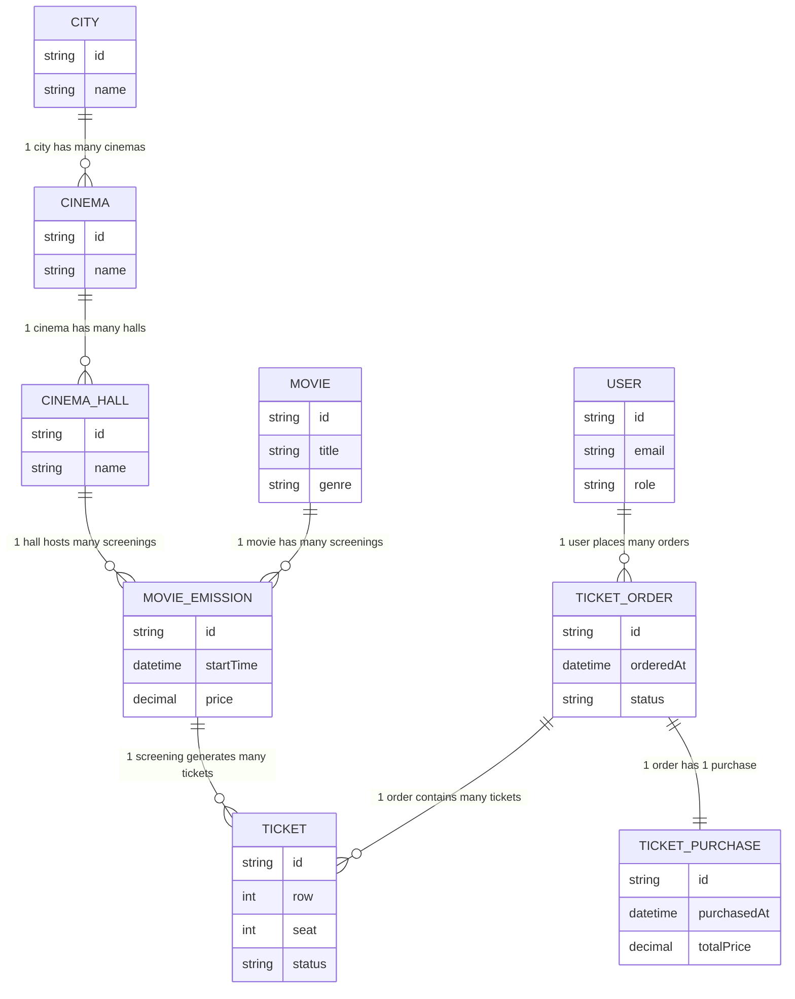
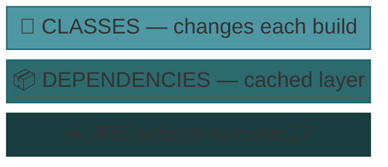
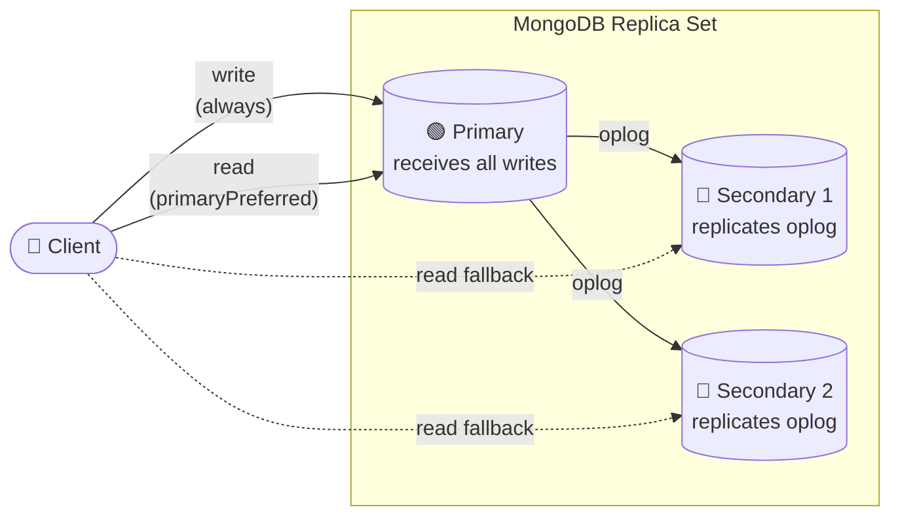

# Reactive RESTful API — Spring WebFlux

> **Archived project** — built a few years ago as a learning exercise. It was **not** migrated
> to Spring Boot 3 or 4 and stays on its original **Spring Boot 2.4.4 / Java 17** baseline.
>
> Recent revisions kept on that baseline:
> - Restored compilation on Java 17 / Spring Boot 2.4.4
> - Closed several reactive-correctness gaps so the Netty event-loop is never blocked (BCrypt, JWT signing/parsing, CSV import, email — all offloaded to `Schedulers.boundedElastic()`)
> - Added 120 unit tests across all application services (Mockito + `StepVerifier`)
>
> ⚠️ **Migration note:** The Spring ecosystem changed significantly between Spring Boot 2.x and
> Spring Boot 3.x / 4.x. A real migration would require:
> - Full `javax.*` → `jakarta.*` package rename (breaking change in every file)
> - Spring Security 6 rewrite — `WebSecurityConfigurerAdapter` removed, replaced with `SecurityFilterChain` beans
> - Mongock API changes (4.x → 5.x driver model)
> - Spring Data MongoDB reactive API updates
> - Minimum Java version bumped to 17 (Boot 3) / 21 (Boot 4)
>
> The project is kept on its original baseline for reference and portfolio purposes.

---

## Table of Contents

1. [Overview](#overview)
2. [Business Domain](#business-domain)
3. [Role-Based Access Control](#role-based-access-control)
4. [Tech Stack](#tech-stack)
5. [Prerequisites](#prerequisites)
6. [Quick Start](#quick-start)
7. [OpenAPI / Swagger UI](#openapi--swagger-ui)
8. [Architecture](#architecture)
9. [MongoDB Replica Set](#mongodb-replica-set)
10. [Docker Commands](#docker-commands)
11. [Non-Blocking Integrations](#non-blocking-integrations)
12. [Tests](#tests)
13. [Why Reactive?](#why-reactive)

---

## Overview

A reactive REST API built with **Domain-Driven Design (DDD)** on top of Spring WebFlux and Netty. The full I/O pipeline is non-blocking: WebFlux router + reactive MongoDB driver + replica set transactions — no blocking thread is ever held during a request.

This is a **cinema ticketing system** — a backend API for managing a network of cinemas and handling the full ticket purchasing flow. Users authenticate via JWT and are assigned one of two roles: **USER** or **ADMIN**.

---

[↑ Back to top](#table-of-contents)

## Business Domain

### User Flow

A typical user journey looks like this:

1. Browse cinemas available in their city
2. Pick a movie and find available screenings
3. Choose seats and place an order
4. Complete the purchase

### Domain Model



---

[↑ Back to top](#table-of-contents)

## Role-Based Access Control

| Endpoint | Public | USER | ADMIN |
|---|:---:|:---:|:---:|
| `POST /register` | ✅ | | |
| `POST /login` | ✅ | | |
| `GET /statistics/**` | ✅ | | |
| `/emails/**` | | ✅ | |
| `GET /cities/**` | | ✅ | |
| `GET /cinemas` | | ✅ | |
| `/movies/**` | | ✅ | ✅ |
| `/tickets/**` | | ✅ | |
| `/ticketOrders/**` | | ✅ | |
| `/ticketsOrders/**` | | ✅ | |
| `/ticketPurchases/**` | | ✅ | |
| `/movieEmissions/**` | | ✅ | ✅ |
| `/users/**` | | | ✅ |
| `/cinemas/**` | | | ✅ |
| `/admin/ticketPurchases/**` | | | ✅ |
| `POST /movies/csv` (bulk import) | | | ✅ |
| `POST /movieEmissions` | | | ✅ |

**Summary:**
- **Public** — registration, login, statistics, Swagger docs
- **USER** — browsing cinemas and movies, managing own tickets, orders, and purchases, sending emails
- **ADMIN** — managing users and cinemas, importing movies via CSV, creating screenings, viewing all purchases

---

[↑ Back to top](#table-of-contents)

## Tech Stack

### Core

| Layer | Technology | Version |
|---|---|---|
| Framework | Spring Boot | 2.4.4 |
| Reactive web | Spring WebFlux + Netty | via Boot |
| Reactive runtime | Project Reactor | via Boot |
| Java | Eclipse Temurin | 17 |

### Persistence

| Layer | Technology | Version |
|---|---|---|
| Database | MongoDB | 4.4.4 |
| Reactive driver | spring-boot-starter-data-mongodb-reactive | via Boot |
| Sync driver | mongodb-driver-sync | via Boot |
| DB migrations | Mongock | 4.2.8.BETA |

### Security & Auth

| Layer | Technology | Version |
|---|---|---|
| Security | Spring Security (WebFlux) | via Boot |
| JWT | JJWT (api / impl / jackson) | 0.11.2 |

### Observability & Tooling

| Layer | Technology | Version |
|---|---|---|
| Logging | Log4j2 (spring-boot-starter-log4j2) | via Boot |
| API docs | springdoc-openapi WebFlux UI | 1.5.2 |
| Blocking detector | BlockHound | 1.0.6.RELEASE |
| Code generation | Lombok | 1.18.34 |

### Infrastructure

| Layer | Technology |
|---|---|
| Containerization | Docker |
| Local orchestration | Docker Compose |
| Production orchestration | Docker Swarm |
| Build tool | Maven 3.8+ |

---

[↑ Back to top](#table-of-contents)

## Prerequisites

- **Docker** and **Docker Compose** (Docker Swarm mode enabled for swarm deployment)
- **Java 17** + **Maven 3.8+** (for local build)

---

[↑ Back to top](#table-of-contents)

## Quick Start

```bash
# 1. Build the application (skip tests for speed)
mvn clean package -DskipTests

# 2. Start all containers (app + MongoDB replica set)
docker-compose up -d --build
```

---

[↑ Back to top](#table-of-contents)

## OpenAPI / Swagger UI

Interactive API documentation is available at:
http://localhost:8080/docs

text

---

[↑ Back to top](#table-of-contents)

## Architecture

The entire application is containerised. The layered Docker image build uses `maven-dependency-plugin` to split the fat JAR into **dependencies** and **classes** — dependencies are cached between builds, only changed classes are re-copied:



Two Docker Compose files are provided:

| File | Purpose |
|---|---|
| `docker-compose.yml` | Local development — builds image from source |
| `docker-swarm.yml` | Production — deploys a stack to Docker Swarm |

---

[↑ Back to top](#table-of-contents)

## MongoDB Replica Set

The app uses **MongoDB distributed transactions**, which require a replica set. Three nodes are configured:



All replica nodes are containerised with persistent Docker volumes.

---

[↑ Back to top](#table-of-contents)

## Docker Commands

### Docker Compose (development)

```bash
# Start all containers in the background
docker-compose up -d --build

# Follow logs
docker-compose logs -f

# Stop and remove containers, networks, volumes
docker-compose down
```

### Docker Swarm (production)

```bash
# Deploy stack
docker stack deploy -c docker-swarm.yml <appName>

# List stack tasks
docker stack ps <appName>

# Remove stack
docker stack rm <appName>
```

---

[↑ Back to top](#table-of-contents)

## Non-Blocking Integrations

Every code path that touches an inherently blocking or CPU-bound API is wrapped in `Mono.fromCallable(...)` and offloaded to Reactor's `Schedulers.boundedElastic()`. The Netty event-loop is never held by hashing, signing, parsing, file I/O, or SMTP work.

- **BCrypt password hashing** — both `PasswordEncoder.encode` (registration) and `PasswordEncoder.matches` (login) run on the bounded elastic scheduler. BCrypt is ~50–100 ms CPU-bound and would otherwise stall the event-loop on every login.
- **JWT issuance and verification** — HS512 signing in `AppTokensService.generateTokens` and claim parsing in `AppTokensService.getId` / `isTokenValid` (called by `AuthenticationManager` on every authenticated request) are executed on the bounded elastic scheduler.
- **Email sending** — `JavaMailSender.send` calls are offloaded to the bounded elastic scheduler. A retry policy (up to 2 attempts with exponential back-off) handles transient SMTP failures; authentication errors are excluded from retries.
- **CSV movie import** — OpenCSV parsing is offloaded via `Flux.using` (which guarantees `BufferedReader` closure even on cancellation) to the bounded elastic scheduler. Each row is validated and checked for uniqueness against MongoDB before writing. If any row fails, the entire import is rejected atomically — no partial saves occur.
- **Reactive MongoDB** — all persistence operations use the reactive driver natively, so no offload is required.

---

## Tests

Unit tests cover all application services and run in under 5 seconds without any external dependencies (MongoDB, SMTP, etc.) — collaborators are mocked with Mockito and reactive flows are asserted using `StepVerifier` from `reactor-test`.

```bash
mvn test
```

**Coverage:** 120 tests across 10 service test classes (`CinemaServiceTest`, `CinemaHallServiceTest`, `CityServiceTest`, `EmailServiceTest`, `MovieEmissionServiceTest`, `MovieServiceTest`, `StatisticsServiceTest`, `TicketOrderServiceTest`, `TicketPurchaseServiceTest`, `UsersServiceTest`).

---

[↑ Back to top](#table-of-contents)


## Why Reactive?

### WebFlux vs Project Loom — Virtual Threads

Java 21 introduced **Virtual Threads** (Project Loom, JEP 444) as a production-ready feature, which changed the calculus around reactive programming significantly.

| Use WebFlux when… | Use Virtual Threads (Spring MVC) when… |
|---|---|
| Full reactive stack: WebClient, R2DBC, reactive MongoDB | Stack uses JDBC / JPA / Hibernate / any blocking driver |
| Real-time streaming: SSE, WebSockets, Kafka consumer | Classic REST microservice |
| Backpressure control is required | Team prefers readable, debuggable synchronous code |
| API gateway / BFF / fan-out edge service | Using blocking third-party SDKs |
| Team is experienced with `Mono`/`Flux` | New project on Java 21+ |

> **Bottom line (2025–2026):** For most CRUD microservices touching a relational database, **Spring MVC + Virtual Threads** is now the pragmatic default. WebFlux remains the right choice for streaming workloads and fully non-blocking stacks.

- ✅ This project uses WebFlux **correctly** — the full stack is non-blocking (reactive MongoDB driver, no JDBC)
- ✅ Reactive Mongo with replica set transactions is a legitimate use case for WebFlux
- ⚠️ If this project were greenfield today and used a relational DB, **Spring MVC + Virtual Threads** would likely be the better choice

---

[↑ Back to top](#table-of-contents)