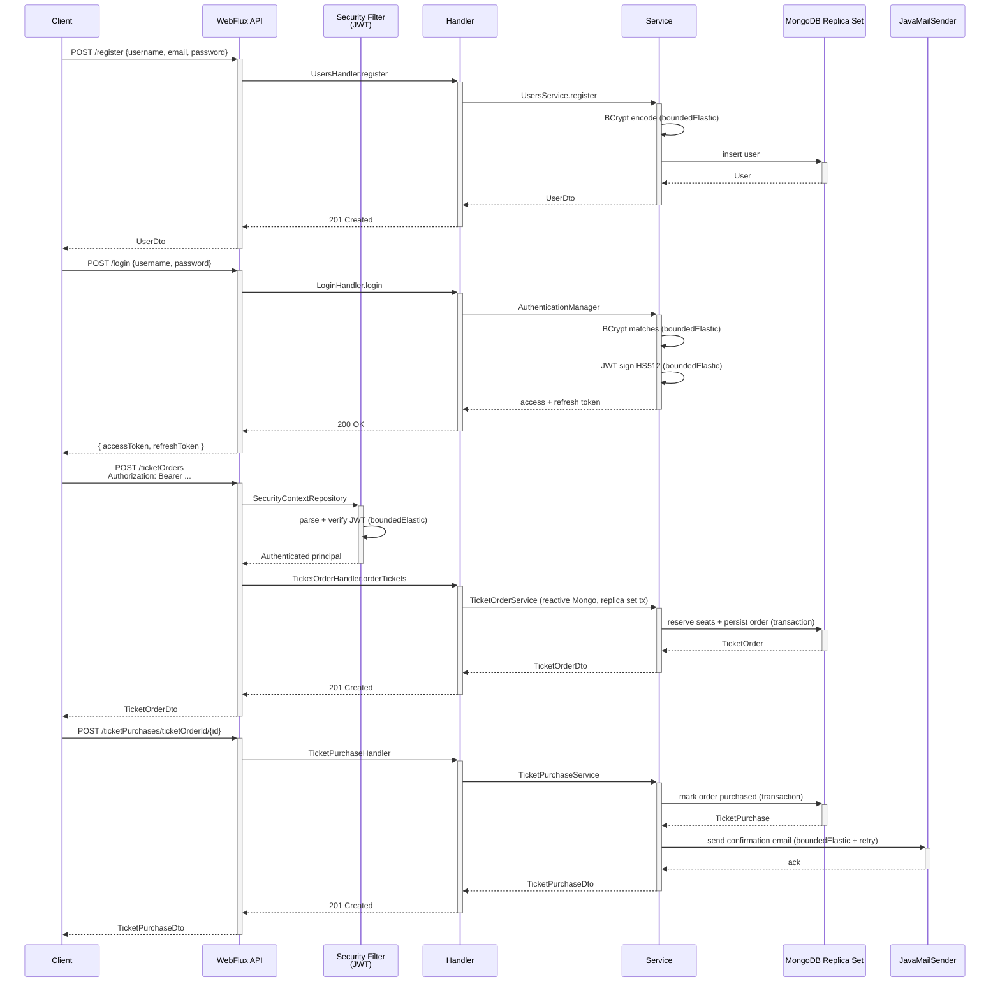
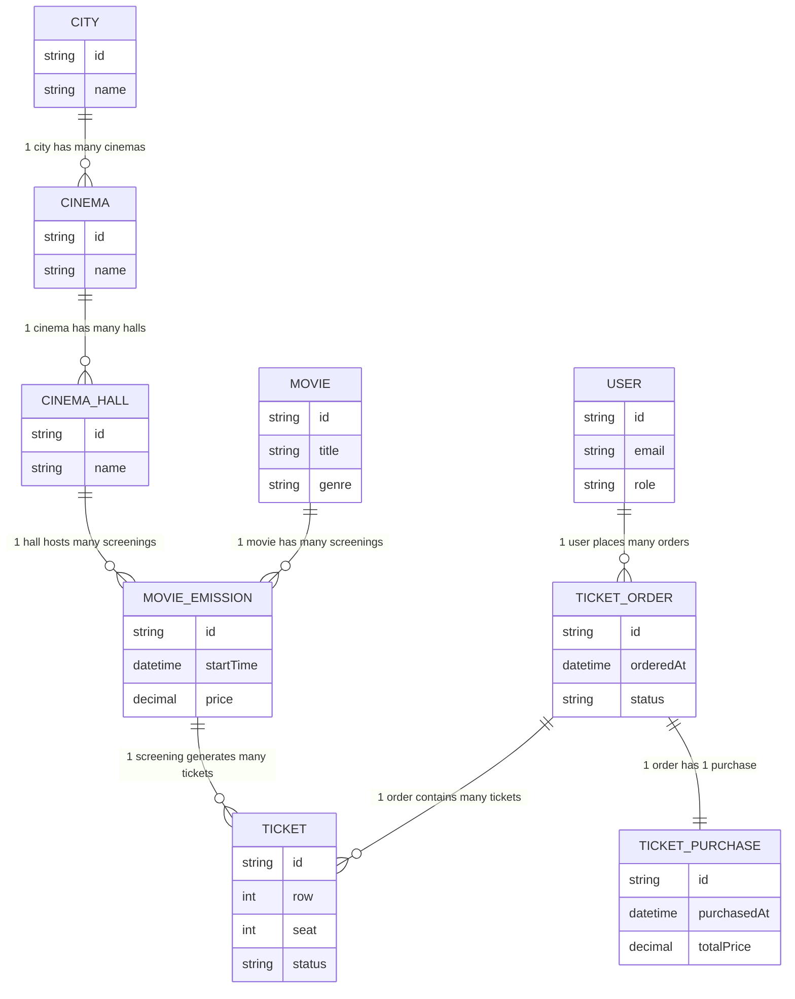
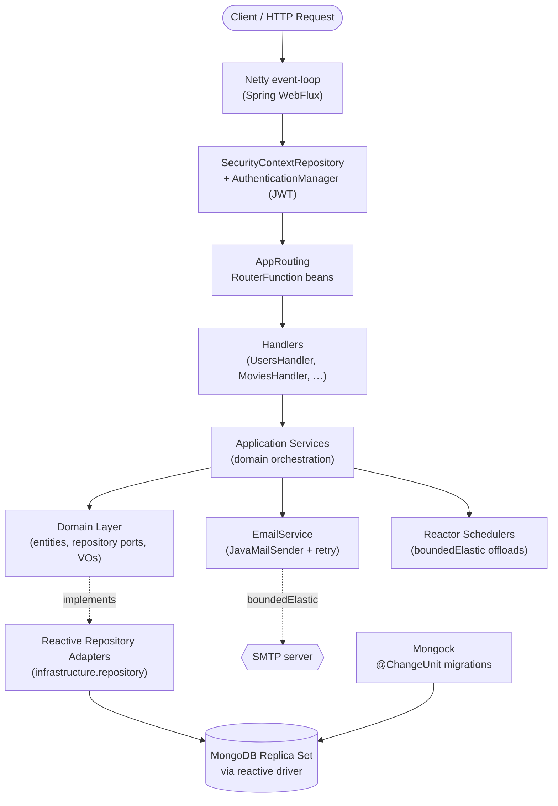
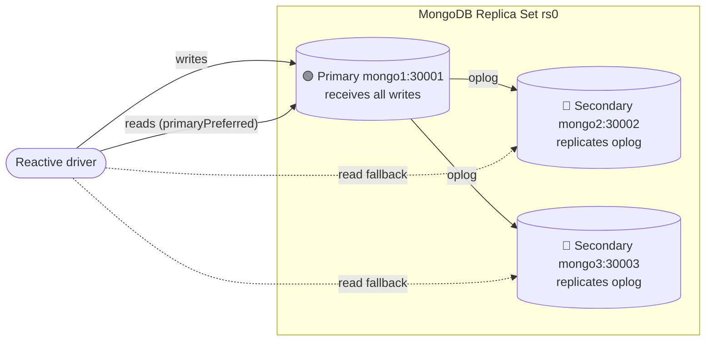

# Reactive RESTful API – Cinema Ticketing Platform (Spring WebFlux)

[](https://spring.io/projects/spring-boot)
[](https://openjdk.org/)
[](https://docs.spring.io/spring-framework/reference/web/webflux.html)
[](https://www.mongodb.com/)
[](https://www.docker.com/)
[](https://opensource.org/licenses/MIT)

> **Archived project.** Originally built as a learning exercise on Spring Boot 2.4.4 / Java 17, then iteratively migrated up to **Spring Boot 4.0.6 / Java 25**. Kept on this baseline for reference and portfolio purposes — see [Migration History](#migration-history) for the full path.

<a id="toc"></a>
## Table of Contents

- [Overview](#overview)
- [How It Works](#how-it-works)
- [Business Domain](#business-domain)
- [Role-Based Access Control](#role-based-access-control)
- [API Endpoints](#api-endpoints)
- [Getting Started](#getting-started)
- [Environment Variables](#environment-variables)
- [Architecture](#architecture)
- [MongoDB Replica Set](#mongodb-replica-set)
- [Non-Blocking Integrations](#non-blocking-integrations)
- [Technical Highlights](#technical-highlights)
- [Tech Stack](#tech-stack)
- [Testing](#testing)
- [Observability](#observability)
- [Repository Structure](#repository-structure)
- [Why Reactive?](#why-reactive)
- [Migration History](#migration-history)
- [Contact](#contact)

---

<a id="overview"></a>
## Overview

[↑ Back to top](#toc)

A reactive REST API for a **cinema ticketing system** — a backend platform that manages a network of cinemas and the full ticket purchasing flow (browse cities → cinemas → screenings → seats → order → purchase). The full I/O pipeline is non-blocking: **Spring WebFlux** routing on Netty, **reactive MongoDB driver** with a 3-node replica set for distributed transactions, and JWT-based authentication. No blocking thread is ever held during a request — every CPU-bound or blocking call (BCrypt, JWT signing, CSV import, SMTP) is explicitly offloaded to `Schedulers.boundedElastic()`.

The project demonstrates **Domain-Driven Design (DDD)** layering, functional-style routing with `RouterFunction` + handlers, role-based access control with Spring Security WebFlux, MongoDB schema migrations via Mongock, and a fully containerised dev environment with both Docker Compose (development) and Docker Swarm (production) descriptors.

---

<a id="how-it-works"></a>
## How It Works

[↑ Back to top](#toc)

End-to-end flow for the canonical use case — a registered user purchasing a ticket:



### Step-by-step

1. **Registration (`POST /register`)** — public endpoint. Password is hashed with BCrypt on `boundedElastic` so the Netty event-loop is never held by the ~50–100 ms hashing work.
2. **Login (`POST /login`)** — verifies credentials and issues a JWT access token (HS512) plus a refresh token. Both signing and verification run on `boundedElastic`.
3. **Authenticated requests** — every protected route is gated by a custom `SecurityContextRepository` + `AuthenticationManager` that parses the bearer token, validates it, and populates the reactive security context. Authorization is then enforced per route (see [Role-Based Access Control](#role-based-access-control)).
4. **Ticket ordering (`POST /ticketOrders`)** — reserves seats and persists the order inside a **MongoDB distributed transaction** (replica set required, see below). Idempotency and concurrency rules are enforced at the service layer.
5. **Ticket purchase (`POST /ticketPurchases/...`)** — finalises an existing order (or buys directly) inside a transaction, then triggers a confirmation email. SMTP is offloaded to `boundedElastic` with up to 2 retries on transient failures.

---

<a id="business-domain"></a>
## Business Domain

[↑ Back to top](#toc)

A typical user journey: **browse cinemas in their city → pick a movie → find a screening → choose seats → place an order → complete the purchase.**

### Domain Model



The domain layer (`com.app.domain`) is independent of Spring infrastructure — entities, repositories (interfaces), and value objects live there. Application services in `com.app.application.service` orchestrate use cases; routing handlers in `com.app.infrastructure.routing.handlers` adapt them to HTTP.

---

<a id="role-based-access-control"></a>
## Role-Based Access Control

[↑ Back to top](#toc)

Authentication is JWT-based. Each user receives one of two roles after registration: **USER** or **ADMIN**. ADMIN can be granted by promoting an existing USER (`POST /users/promoteToAdmin/username/{username}`).

| Endpoint | Public | USER | ADMIN |
|---|:---:|:---:|:---:|
| `POST /register` | ✅ | | |
| `POST /login` | ✅ | | |
| `GET /statistics/**` | ✅ | | |
| `/docs`, `/v3/api-docs/**` (Swagger) | ✅ | | |
| `/emails/**` | | ✅ | |
| `GET /cities/**` | | ✅ | |
| `GET /cinemas` | | ✅ | |
| `/movies/**` | | ✅ | ✅ |
| `/tickets/**` | | ✅ | |
| `/ticketOrders/**` | | ✅ | |
| `/ticketsOrders/**` | | ✅ | |
| `/ticketPurchases/**` | | ✅ | |
| `/movieEmissions/**` | | ✅ | ✅ |
| `/users/**` | | | ✅ |
| `/cinemas/**` (write) | | | ✅ |
| `/admin/ticketPurchases/**` | | | ✅ |
| `POST /movies/csv` (bulk import) | | | ✅ |
| `POST /movieEmissions` | | | ✅ |

---

<a id="api-endpoints"></a>
## API Endpoints

[↑ Back to top](#toc)

Base URL (local): `http://localhost:8080`. Authentication is performed via `Authorization: Bearer <accessToken>` (token returned by `POST /login`).

The full surface is defined as functional `RouterFunction` beans in `com.app.infrastructure.routing.AppRouting`. Highlights:

### Auth & Users

| Method | Path | Description | Roles |
|---|---|---|---|
| `POST` | `/register` | Create a new account | Public |
| `POST` | `/login` | Issue access + refresh JWTs | Public |
| `GET` | `/users` | List all users | ADMIN |
| `GET` | `/users/username/{username}` | Get user by username | ADMIN |
| `POST` | `/users/promoteToAdmin/username/{username}` | Grant ADMIN role | ADMIN |

### Cities, Cinemas, Halls

| Method | Path | Description | Roles |
|---|---|---|---|
| `POST` | `/cities` | Create city | ADMIN |
| `GET` | `/cities` | List cities | USER |
| `GET` | `/cities/name/{name}` | Find city by name | USER |
| `PUT` | `/cities` | Attach a cinema to a city | ADMIN |
| `POST` | `/cinemas` | Create cinema | ADMIN |
| `GET` | `/cinemas` | List cinemas | USER |
| `GET` | `/cinemas/city/{city}` | List cinemas in a city | USER |
| `PUT` | `/cinemas/id/{id}/addCinemaHall` | Add hall to cinema | ADMIN |
| `GET` | `/cinemaHalls` | List all halls | USER |
| `GET` | `/cinemaHalls/cinemaId/{cinemaId}` | List halls of a cinema | USER |
| `POST` | `/cinemaHalls/addToCinema/cinemaId/{cinemaId}` | Add hall | ADMIN |

### Movies & Screenings

| Method | Path | Description | Roles |
|---|---|---|---|
| `GET` | `/movies` | List all movies | USER / ADMIN |
| `GET` | `/movies/id/{id}` | Get movie by id | USER / ADMIN |
| `POST` | `/movies` | Add a movie | ADMIN |
| `DELETE` | `/movies/id/{id}` | Delete a movie | ADMIN |
| `PATCH` | `/movies/addToFavorites/{id}` | Add to user's favorites | USER |
| `GET` | `/movies/favorites` | List user's favorites | USER |
| `GET` | `/movies/filter/premiereDate` | Filter by premiere date | USER / ADMIN |
| `GET` | `/movies/filter/duration` | Filter by duration | USER / ADMIN |
| `GET` | `/movies/filter/name/{name}` | Filter by name | USER / ADMIN |
| `GET` | `/movies/filter/genre/{genre}` | Filter by genre | USER / ADMIN |
| `GET` | `/movies/filter/keyword/{keyword}` | Full-text-ish keyword filter | USER / ADMIN |
| `POST` | `/movies/csv` | Bulk import from CSV (atomic) | ADMIN |
| `POST` | `/movieEmissions` | Schedule a screening | ADMIN |
| `GET` | `/movieEmissions` | List all screenings | USER / ADMIN |
| `GET` | `/movieEmissions/movieId/{movieId}` | Screenings of a movie | USER / ADMIN |
| `GET` | `/movieEmissions/cinemaHallId/{cinemaHallId}` | Screenings in a hall | USER / ADMIN |
| `DELETE` | `/movieEmissions/{id}` | Cancel a screening | ADMIN |

### Orders & Purchases

| Method | Path | Description | Roles |
|---|---|---|---|
| `POST` | `/ticketOrders` | Place a ticket order | USER |
| `PUT` | `/ticketsOrders/cancel/orderId/{orderId}` | Cancel an order | USER |
| `GET` | `/ticketsOrders/username` | List logged user's orders | USER |
| `POST` | `/ticketPurchases` | Buy a ticket directly | USER |
| `POST` | `/ticketPurchases/ticketOrderId/{id}` | Finalise an existing order | USER |
| `GET` | `/ticketPurchases` | Logged user's purchases | USER |
| `GET` | `/ticketPurchases/city/{city}` | …filtered by city | USER |
| `GET` | `/ticketPurchases/cinemaId/{cinemaId}` | …filtered by cinema | USER |
| `GET` | `/ticketPurchases/movieId/{movieId}` | …filtered by movie | USER |
| `GET` | `/admin/ticketPurchases` | All purchases | ADMIN |
| `GET` | `/admin/ticketPurchases/dates` | All purchases by date range | ADMIN |
| `GET` | `/admin/ticketPurchases/city/{city}` | All purchases by city | ADMIN |
| `GET` | `/admin/ticketPurchases/cinemaId/{cinemaId}` | …by cinema | ADMIN |
| `GET` | `/admin/ticketPurchases/cinemaHallId/{cinemaHallId}` | …by hall | ADMIN |
| `GET` | `/admin/ticketPurchases/movieId/{movieId}` | …by movie | ADMIN |

### Email & Statistics

| Method | Path | Description | Roles |
|---|---|---|---|
| `POST` | `/emails/send/single` | Send single email | USER |
| `POST` | `/emails/send/multiple` | Send batch | USER |
| `GET` | `/statistics/cities/cinemaFrequency` | Cinema count per city | Public |
| `GET` | `/statistics/cities/cinemaFrequency/max` | City with most cinemas | Public |
| `GET` | `/statistics/movies/mostPopular/byCity` | Most popular movie per city | Public |
| `GET` | `/statistics/movies/frequency` | Per-movie ticket frequency | Public |
| `GET` | `/statistics/movies/mostPopularGroupedByGenre/byCity/{city}` | Top movies per genre in a city | Public |
| `GET` | `/statistics/averageTicketPrice` | Average ticket price per city | Public |

> Browse the full, interactive contract at **[Swagger UI](#openapi--swagger-ui)** once the application is running.

---

<a id="getting-started"></a>
## Getting Started

[↑ Back to top](#toc)

### Prerequisites

- **Docker** and **Docker Compose v2** (Docker Swarm mode enabled if you want to deploy via `docker-swarm.yml`)
- **Java 25** + **Maven 3.9+** _(only if running outside containers)_

### 1. Provide the SMTP password

Email sending requires an SMTP credential. The Compose file expects `MAIL_PASSWORD` to be present in the environment (or in a `.env` file next to `docker-compose.yml`):

```bash
echo "MAIL_PASSWORD=your-smtp-app-password" > .env
```

> The default SMTP host (`smtp.gmail.com`) and username are configured in `application.yml`. Override them there if you don't want to use the bundled Gmail relay.

### 2. Build the application

```bash
mvn clean package -DskipTests
```

The `maven-dependency-plugin` `unpack` execution prepares `target/dependency/` for the layered Docker image.

### 3. Start the stack

```bash
docker compose up -d --build
```

This brings up:
- `mongo1`, `mongo2`, `mongo3` — three-node MongoDB 4.4.4 replica set (`rs0`)
- `app` — the WebFlux service, with healthcheck-gated startup waiting for the primary node

### 4. Verify

| Resource | URL |
|----------|-----|
| API | `http://localhost:8080` |
| Swagger UI | `http://localhost:8080/docs` |
| OpenAPI JSON | `http://localhost:8080/v3/api-docs` |
| Remote debug (JDWP) | `localhost:5005` |
| MongoDB primary | `localhost:30001` |

---

<a id="openapi--swagger-ui"></a>
### OpenAPI / Swagger UI

Interactive API documentation is generated by **springdoc-openapi WebFlux** and served at:

```
http://localhost:8080/docs
```

Each functional route in `AppRouting` is annotated with `@RouterOperation` so the operation is picked up by the OpenAPI scanner — there is no extra controller layer.

---

<a id="environment-variables"></a>
## Environment Variables

[↑ Back to top](#toc)

| Variable | Required | Description | Default |
|----------|----------|-------------|---------|
| `MAIL_PASSWORD` | yes | SMTP password used by `JavaMailSender` (Gmail app password by default) | — |
| `SPRING_PROFILES_ACTIVE` | no | Spring profile loaded at startup; the Dockerfile pins it to `docker` | `docker` |

Application-level configuration (Mongo URI, JWT lifetimes, admin bootstrap credentials, springdoc paths) lives in `src/main/resources/application.yml`. Override via standard Spring Boot mechanisms (env vars, `--spring.config.additional-location`, etc.).

---

<a id="architecture"></a>
## Architecture

[↑ Back to top](#toc)

The codebase follows **Domain-Driven Design** layering with a strict dependency direction (`presentation → application → domain`, `infrastructure` provides adapters):



### Layer responsibilities

| Layer | Package | Responsibility |
|---|---|---|
| Presentation | `infrastructure.routing` (handlers + `AppRouting`) | Map HTTP requests to application services; serialise responses; emit OpenAPI metadata. |
| Application | `application.service`, `application.dto`, `application.validator` | Use-case orchestration, DTO ↔ domain mapping, input validation. |
| Domain | `domain.*` | Pure business model — entities, value objects, repository interfaces. No Spring imports. |
| Infrastructure | `infrastructure.*` | Reactive Mongo adapters, security configuration, Mongock changesets, AOP, OpenAPI config. |

### Key infrastructure pieces

- **`AppRouting`** — single source of truth for HTTP routes; every route also carries `@RouterOperation` so springdoc can render it.
- **`SecurityContextRepository` + `AuthenticationManager`** — custom reactive components that decode the bearer JWT, validate it (signing key + expiration), and populate the security context.
- **Mongock 5** — schema migrations applied at startup. Migration units live in `infrastructure.mongo.initscripts`.
- **Reactive Mongo with replica-set transactions** — `TicketOrderService` and `TicketPurchaseService` use `TransactionalOperator` semantics to atomically reserve seats / mark orders purchased.

> The image is **layered** for fast incremental builds: Maven's `maven-dependency-plugin unpack` splits the fat JAR into a cached _dependencies_ layer and a small _classes_ layer that changes per build.

---

<a id="mongodb-replica-set"></a>
## MongoDB Replica Set

[↑ Back to top](#toc)

The application relies on **MongoDB distributed transactions**, which require a replica set (a single standalone `mongod` cannot host transactions). Three nodes are configured in `docker-compose.yml`:



Each node runs in its own container with a persistent Docker volume (`./data/mongo-{1,2,3}`). The healthcheck on `mongo1` runs `rs.initiate(...)` so the replica set bootstraps automatically on first start.

The connection string used by Spring Data is:

```
mongodb://mongo1:30001,mongo2:30002,mongo3:30003/?replicaSet=rs0
```

---

<a id="non-blocking-integrations"></a>
## Non-Blocking Integrations

[↑ Back to top](#toc)

Every code path that touches an inherently blocking or CPU-bound API is wrapped in `Mono.fromCallable(...)` and offloaded to Reactor's `Schedulers.boundedElastic()`. The Netty event-loop is never held by hashing, signing, parsing, file I/O, or SMTP work.

| Operation | Where | Why offload |
|---|---|---|
| **BCrypt password hashing** — `PasswordEncoder.encode` (registration), `PasswordEncoder.matches` (login) | `UsersService`, `AuthenticationManager` | ~50–100 ms CPU-bound; would otherwise stall the event-loop on every login. |
| **JWT issuance & verification** — HS512 signing, claim parsing, expiration check | `AppTokensService` (called by `AuthenticationManager` on every authenticated request) | CPU-bound; runs on every protected request. |
| **Email sending** — `JavaMailSender.send` | `EmailService` | Blocking SMTP I/O. Up to 2 retries with exponential back-off; authentication errors are excluded from retries. |
| **CSV movie import** — OpenCSV parsing of an uploaded file | `MoviesHandler` / `MovieService` | Blocking file I/O. Wrapped in `Flux.using` so the `BufferedReader` is closed on cancellation. Each row is validated and uniqueness-checked before write; if any row fails, the entire import is rejected atomically. |
| **MongoDB persistence** | all repository adapters | _No offload required_ — the reactive driver is non-blocking natively. |

---

<a id="technical-highlights"></a>
## Technical Highlights

[↑ Back to top](#toc)

- **Fully reactive stack** — Spring WebFlux on Netty + reactive MongoDB driver. No JDBC, no blocking thread held during a request.
- **Functional routing** — `RouterFunction` + handler beans (no `@RestController`), with `@RouterOperation` annotations powering springdoc.
- **MongoDB distributed transactions** — three-node replica set; ticket orders and purchases are atomic across multiple collections.
- **Schedulers discipline** — every CPU-bound or blocking call is explicitly offloaded to `Schedulers.boundedElastic()`; the Netty event-loop is never blocked. See [Non-Blocking Integrations](#non-blocking-integrations).
- **Mongock 5 migrations** — versioned schema changes via `@ChangeUnit`, applied at startup.
- **JWT with refresh tokens** — HS512-signed access tokens (5 min) plus 8 h refresh tokens.
- **DDD layering** — domain layer free of Spring imports; ports defined in `domain`, adapters in `infrastructure`.
- **Atomic CSV import** — bulk movie import either fully succeeds or rejects; no partial saves.
- **Layered Docker image** — `maven-dependency-plugin` unpacks the fat JAR; cached dependency layer, small per-build classes layer.
- **Two deploy targets** — `docker-compose.yml` for local dev, `docker-swarm.yml` for production stack deploy.

---

<a id="tech-stack"></a>
## Tech Stack

[↑ Back to top](#toc)

### Core

| Layer | Technology | Version |
|---|---|---|
| Language | Java (Eclipse Temurin) | 25 |
| Framework | Spring Boot | 4.0.6 |
| Reactive web | Spring WebFlux + Netty | via Boot |
| Reactive runtime | Project Reactor | via Boot |

### Persistence

| Layer | Technology | Version |
|---|---|---|
| Database | MongoDB (replica set) | 4.4.4 |
| Reactive driver | `spring-boot-starter-data-mongodb-reactive` | via Boot |
| DB migrations | Mongock (`mongock-springboot-v3` + `mongodb-reactive-driver`) | 5.4.4 |

### Security & Auth

| Layer | Technology | Version |
|---|---|---|
| Security | Spring Security (WebFlux, `SecurityWebFilterChain`) | via Boot |
| JWT | JJWT (`jjwt-api` / `-impl` / `-jackson`) | 0.12.6 |

### Observability & Tooling

| Layer | Technology | Version |
|---|---|---|
| Logging | Log4j2 (`spring-boot-starter-log4j2`) | via Boot |
| API docs | `springdoc-openapi-starter-webflux-ui` / `-api` | 2.8.13 |
| Validation | Apache Commons Validator | 1.9.0 |
| Date/time | Joda-Time | 2.12.7 |
| CSV | OpenCSV | 5.9 |
| AOP | `spring-boot-starter-aspectj` | via Boot |
| Code generation | Lombok | 1.18.38 |

### Infrastructure

| Layer | Technology |
|---|---|
| Containerisation | Docker (layered build, Eclipse Temurin 25 JRE) |
| Local orchestration | Docker Compose |
| Production orchestration | Docker Swarm |
| Build tool | Maven 3.9+ |

---

<a id="testing"></a>
## Testing

[↑ Back to top](#toc)

Unit tests cover all application services and run in **under 5 seconds** without any external dependencies (MongoDB, SMTP, …) — collaborators are mocked with **Mockito** and reactive flows are asserted using `StepVerifier` from `reactor-test`.

```bash
mvn test
```

**Coverage:** ~120 tests across 10 service test classes:

```
CinemaHallServiceTest    EmailServiceTest          StatisticsServiceTest
CinemaServiceTest        MovieEmissionServiceTest  TicketOrderServiceTest
CityServiceTest          MovieServiceTest          TicketPurchaseServiceTest
                                                   UsersServiceTest
```

All reactive pipelines (`Mono`/`Flux`) are verified with `StepVerifier` — completion signals, ordering, and error propagation are all asserted explicitly.

---

<a id="observability"></a>
## Observability

[↑ Back to top](#toc)

- **Logging** — Log4j2 (the default Logback starter is excluded), configured via `src/main/resources/log4j.yml`.
- **OpenAPI / Swagger UI** — `http://localhost:8080/docs` (see [OpenAPI / Swagger UI](#openapi--swagger-ui)).
- **Remote debug** — the Dockerfile exposes JDWP on `*:5005` (mapped to host `5005` in Compose). Useful for IDE attach during local development.

---

<a id="repository-structure"></a>
## Repository Structure

[↑ Back to top](#toc)

```
.
├── src/
│   ├── main/
│   │   ├── java/com/app/
│   │   │   ├── CinemaApplication.java                # Spring Boot entry point
│   │   │   ├── application/
│   │   │   │   ├── dto/                              # Request / response / projection DTOs
│   │   │   │   ├── exception/                       # Application-layer exceptions + GlobalExceptionHandler
│   │   │   │   ├── service/                          # Use-case orchestration (CinemaService, MovieService, …)
│   │   │   │   └── validator/                        # Reactive DTO validators
│   │   │   ├── domain/
│   │   │   │   ├── cinema/                           # Aggregates (Cinema, Movie, MovieEmission, Ticket, …)
│   │   │   │   ├── cinema_hall/                      # Each subpackage exposes entity + repository port
│   │   │   │   ├── city/
│   │   │   │   ├── movie/
│   │   │   │   ├── movie_emission/
│   │   │   │   ├── security/                         # User, Admin, BaseUser
│   │   │   │   ├── ticket/
│   │   │   │   ├── ticket_order/
│   │   │   │   ├── ticket_purchase/
│   │   │   │   └── generic/                          # CrudRepository, GenericEntity
│   │   │   └── infrastructure/
│   │   │       ├── aspect/                           # Spring AOP cross-cutting concerns
│   │   │       ├── mongo/
│   │   │       │   ├── initscripts/                  # Mongock @ChangeUnit migrations
│   │   │       │   └── …                             # Mongo configuration, custom converters
│   │   │       ├── openapi/                          # Springdoc grouping + customisers
│   │   │       ├── repository/                       # Reactive Mongo repository adapters
│   │   │       ├── routing/
│   │   │       │   ├── AppRouting.java               # All RouterFunction beans + @RouterOperation
│   │   │       │   └── handlers/                     # CinemasHandler, MoviesHandler, …
│   │   │       └── security/
│   │   │           ├── AppUserDetailsService.java
│   │   │           ├── AuthenticationManager.java
│   │   │           ├── SecurityContextRepository.java
│   │   │           ├── config/                       # SecurityWebFilterChain, PasswordEncoderConfig
│   │   │           ├── dto/
│   │   │           └── tokens/                       # AppTokensService (JJWT)
│   │   └── resources/
│   │       ├── application.yml                       # Mongo URI, mail, JWT, springdoc, mongock
│   │       └── log4j.yml                             # Log4j2 configuration
│   └── test/                                         # Unit tests (Mockito + StepVerifier)
├── docker-compose.yml                                # Local: 3-node Mongo replica set + app
├── docker-swarm.yml                                  # Production: stack deploy
├── Dockerfile                                        # Layered build (deps + classes), JRE 25
├── pom.xml                                           # Spring Boot 4.0.6, Java 25
├── .gitignore
└── readme.md
```

---

<a id="why-reactive"></a>
## Why Reactive?

[↑ Back to top](#toc)

### WebFlux vs Project Loom — Virtual Threads

Java 21+ introduced **Virtual Threads** (Project Loom, JEP 444) as a production-ready feature, which changed the calculus around reactive programming significantly.

| Use WebFlux when… | Use Virtual Threads (Spring MVC) when… |
|---|---|
| Full reactive stack: WebClient, R2DBC, reactive MongoDB | Stack uses JDBC / JPA / Hibernate / any blocking driver |
| Real-time streaming: SSE, WebSockets, Kafka consumer | Classic REST microservice |
| Backpressure control is required | Team prefers readable, debuggable synchronous code |
| API gateway / BFF / fan-out edge service | Using blocking third-party SDKs |
| Team is experienced with `Mono`/`Flux` | New project on Java 21+ |

> **Bottom line (2025–2026):** for most CRUD microservices touching a relational database, **Spring MVC + Virtual Threads** is now the pragmatic default. WebFlux remains the right choice for streaming workloads and fully non-blocking stacks.

- ✅ This project uses WebFlux **correctly** — the full stack is non-blocking (reactive MongoDB driver, no JDBC).
- ✅ Reactive Mongo with replica-set transactions is a legitimate WebFlux use case.
- ⚠️ If this project were greenfield today and used a relational DB, **Spring MVC + Virtual Threads** would likely be the better choice.

---

<a id="migration-history"></a>
## Migration History

[↑ Back to top](#toc)

The project has gone through several baseline upgrades since the original Spring Boot 2.4.4 / Java 17 implementation. Each phase is summarised below.

### Phase 1 — Java 17 → Java 21 (Spring Boot 2.x baseline)

JDK-only bump: `maven-compiler-plugin` target updated to 21, base Docker image switched to `eclipse-temurin:21`, `java.version` property updated. No source changes were required since the project did not use APIs removed between 17 and 21.

### Phase 2 — Spring Boot 2.4.4 → Spring Boot 3.5.13 (Java 21)

Full Spring Boot 3 migration. Spring Boot 3 requires Java 17+ and ships with the Jakarta EE 9 namespace, which meant a significant number of changes:

- **`javax.*` → `jakarta.*`** — all Jakarta EE imports renamed (mail, security, etc.). Most widespread change.
- **Spring Security 6** — `WebSecurityConfigurerAdapter` is gone; the security config was rewritten using a `SecurityWebFilterChain` bean with the lambda DSL. A circular dependency between `WebSecurityConfig`, `AuthenticationManager`, and `AppTokensService` (caused by `PasswordEncoder` being defined in the security config) was resolved by extracting `PasswordEncoder` to a dedicated `PasswordEncoderConfig` class.
- **Mongock 4.x → 5.x** — Mongock 4 was internally dependent on `javax.*`. Replaced the BOM and driver with `io.mongock:mongock-springboot-v3` and `io.mongock:mongodb-reactive-driver`, switched to `@EnableMongock` auto-configuration, and replaced `@ChangeLog` / `@ChangeSet` with the new `@ChangeUnit` / `@Execution` / `@RollbackExecution` model.
- **JJWT 0.11.x → 0.12.6** — the entire builder/parser API was deprecated in 0.11 and removed in 0.12. All builder calls were updated to the new fluent API (`subject()`, `expiration()`, `issuedAt()` instead of `setSubject()` etc.); `parserBuilder()` → `parser()`, `parseClaimsJws()` → `parseSignedClaims()`, `getBody()` → `getPayload()`. The `SecretKey` bean was updated from `Keys.secretKeyFor(SignatureAlgorithm.HS512)` to `Jwts.SIG.HS512.key().build()`.
- **MongoDB custom converter** — `PositionMapToBSONObjectConverter` was returning `org.bson.BSONObject`, which is no longer recognised as a store-supported type in Spring Data MongoDB 4.x. The converter now returns `org.bson.Document`.
- **springdoc-openapi 1.x → 2.8.13** — replaced with `springdoc-openapi-starter-webflux-ui` and `springdoc-openapi-starter-webflux-api`. The Swagger UI security permit-list in `WebSecurityConfig` was expanded to cover the new default paths (`/swagger-ui/**`, `/swagger-ui.html`, `/v3/api-docs`); `config-url` / `url` properties were added to `application.yml` to correctly wire the UI to the API spec.

### Phase 3 — Spring Boot 3.5 → Spring Boot 4.0.6 (Java 21)

Bumped the parent BOM to `spring-boot-starter-parent:4.0.6`. Spring Framework 7 / Spring Boot 4 introduced no Jakarta-style mass renames, but several adjustments were needed (dependency tree changes, Jackson configuration tweaks via `tools.jackson.dataformat:jackson-dataformat-yaml`).

### Phase 4 — Java 21 → Java 25

Final JDK bump: `release` set to 25 in `maven-compiler-plugin`, base image switched to `eclipse-temurin:25-jre`, `java.version` property updated. No source changes required.

---

<a id="contact"></a>
## Contact

[↑ Back to top](#toc)

Project kept on the **Spring Boot 4.0.6 / Java 25** baseline for reference and portfolio purposes.
